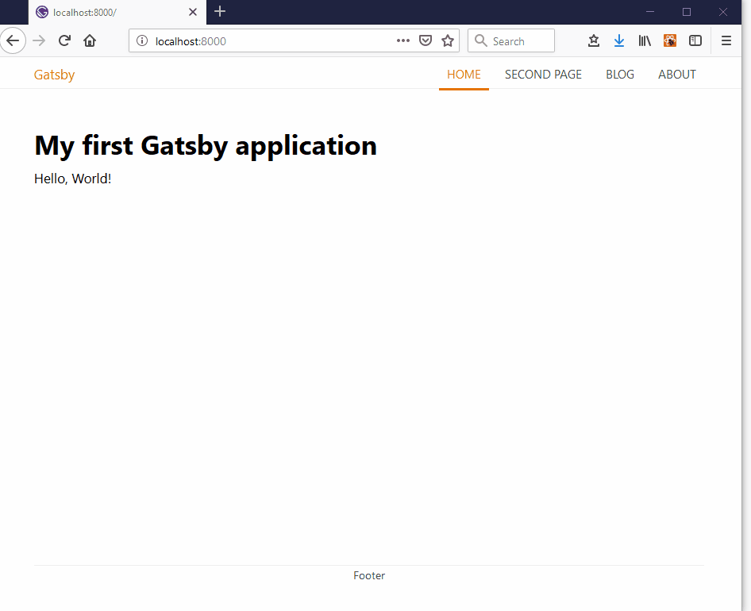

# Creating a responsive menu <!-- omit in toc -->

<!-- markdownlint-disable MD007 -->

- [Overview](#overview)
- [Želim samo pokrenuti demo](#Želim-samo-pokrenuti-demo)

## Overview

<!-- markdownlint-disable MD033 -->
<p align="center">
    
    <br><br>
    <em>A simple responsive menu - final result</em>
</p>

Kod za prikazanu web stranicu možete naći u direktoriju [hello-blog](hello-blog). Kod možete eventualno prilagoditi vlastitim potrebama.

U okviru labova prokomentirati ćemo važne aspekte ovog koda. Pozorniji student primjetit će da smo donekle refaktorirali originalni kod.

## Želim samo pokrenuti demo

1. Klonirajte cijeli HCI-2018-19 repozitorij na lokalno računalo.

   ```console
   > git clone https://github.com/mcagalj/HCI-2018-19
   ```

2. Uđite u direktorij `HCI-2018-19/bits-of-gatsby/creating-responsive-menu/hello-blog`.

3. Instalirajte potrebne module:

   ```console
   > npm install
   ```

4. Konačno, u istom direktoriju, pokrenite _development_ server:

   ```console
   > npm start
   ```

   Alternativno:

   ```console
   > gatsby develop
   ```

Voilà!
